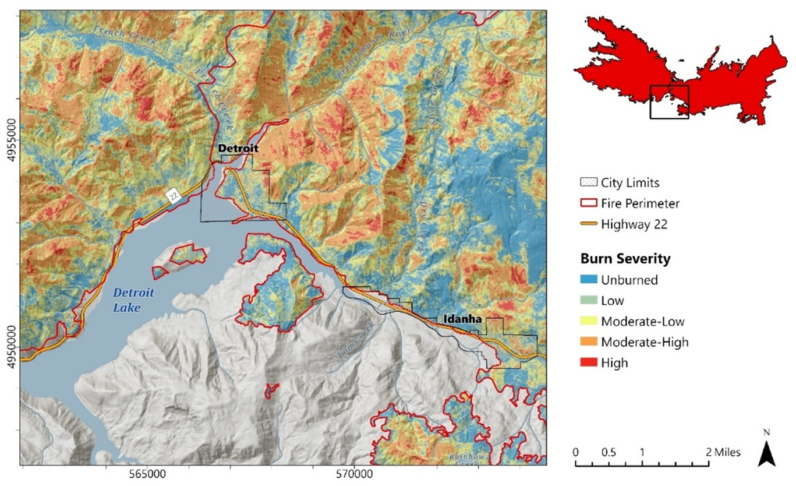
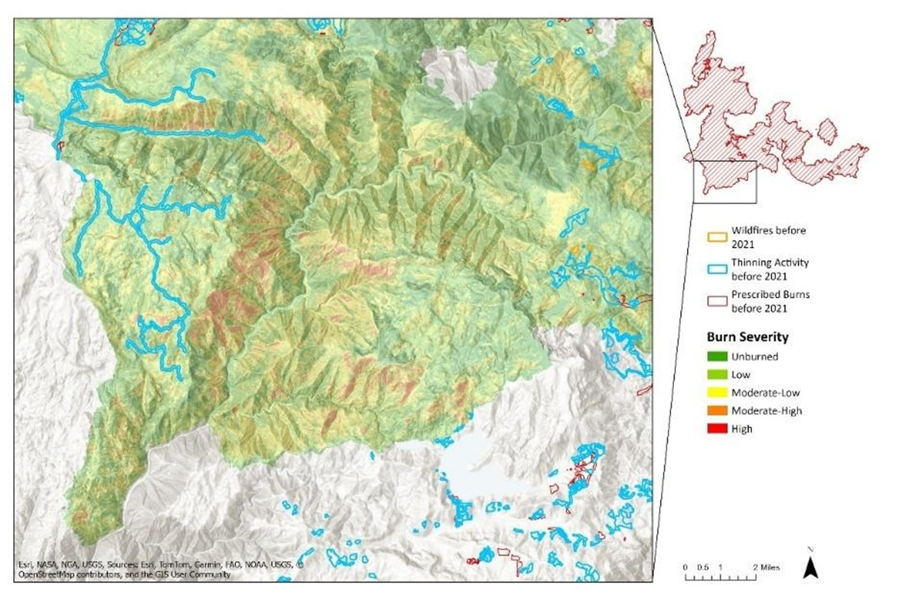
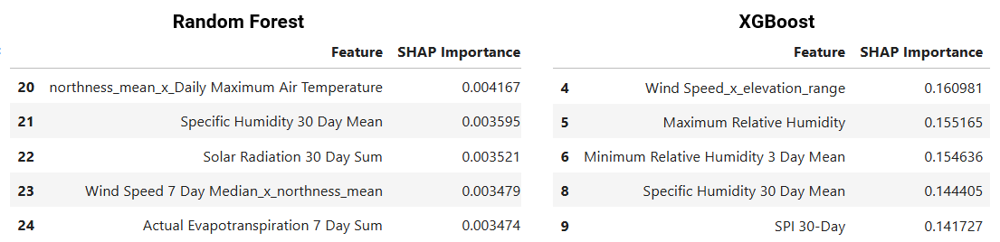
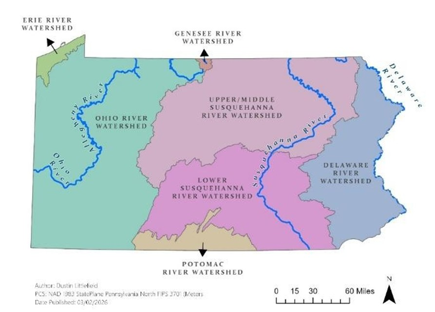

<h1 align="center" style="margin-top:12px; margin-bottom:4px;">
  Dustin Littlefield
</h1>

  Geospatial & Environmental Analytics • LiDAR • Remote Sensing

## About Me
Greetings, I’m a geospatial and natural resources analytics specialist with a strong foundation in data science and graduate‑level remote sensing. After a 15‑year career in medical laboratory science, I transitioned into geospatial data science to focus on natural resource management, geospatial analytics, and clear technical communication. Currently, for remote sensing coursework at Penn State, I am developing LiDAR workflows for wildfire‑affected forest structure in Orergon, which includes terrain modeling, canopy height metrics, and environmental impact analysis. My strengths include reproducible geospatial data science pipelines, LiDAR processing, and generating clear practical insights from complex, spatial data.

<h2>Featured Projects</h2>

  <strong>LiDAR Post‑Fire Forest Structure Analysis (In Progress)</strong> 
  A PDAL‑based workflow for canopy height modeling, terrain differencing, and vegetation structure metrics in wildfire‑affected landscapes. 
  <strong>Tools:</strong> PDAL | Python | rasterio | GDAL | ArcGIS Pro 
  <strong>Focus:</strong> LiDAR | wildfire | forest structure 
  <strong>Report:</strong>
  <a href="https://dustinlit.github.io/Beachie-Creek-LiDAR-Postfire-Analysis/">
    Beachie Creek LiDAR Post‑Fire Analysis
  </a>

  <strong>Remote Sensing Assessment of Burn Severity and Vegetation Mortality in the 2020 Beachie Creek–Lionshead Complex Fire</strong> 
  A multi‑sensor burn severity and vegetation mortality assessment using Landsat and terrain derivatives. 
  <strong>Tools:</strong> ArcGIS Pro | Landsat 8 | NDVI/NBR/dNBR | USGS Burn Severity Classification | Terrain Derivatives 
  <strong>Focus:</strong> wildfire | burn severity | vegetation mortality | remote sensing 
  <strong>Report:</strong>
  <a href="https://dustinlit.github.io/Burn-Severity-and-Vegetation-Mortality-Analysis-of-the-Beachie-Creek-Lionshead-Complex-Fire/">
    Burn Severity & Vegetation Mortality Report
  </a>

<!-- Beachie Creek Burn Severity -->

  

  <strong>Dixie Fire Burn Severity Analysis</strong> 
  A burn severity assessment using Landsat‑based NBR differencing and USGS severity classification. 
  <strong>Tools:</strong> ArcGIS Pro | Landsat 8 | NBR/dNBR | USGS Burn Severity Classification 
  <strong>Focus:</strong> wildfire | burn severity | remote sensing 
  <strong>Report:</strong>
  <a href="https://dustinlit.github.io/Dixie-Fire-Burn-Severity-Analysis/">
    Dixie Fire Burn Severity Report
  </a>

<!-- Dixie Fire Severity -->

  

  <strong>Geospatial Machine Learning Pipeline for Wildfire Ignition Risk in California</strong> 
  A machine‑learning analysis of six years of California wildfire ignition patterns using weather, vegetation, topography, infrastructure, and demographic predictors. 
  <strong>Tools:</strong> Python | scikit‑learn | Pandas | rasterio | ArcGIS Pro 
  <strong>Focus:</strong> wildfire ignition | ML modeling | environmental analytics 
  <strong>Report:</strong>
  <a href="https://dustinlit.github.io/California-Wildfire-Ignition-ML-Modeling/">
    California Wildfire Ignition ML Modeling
  </a>

<!-- California ML Wildfire Ignition -->

  

  <strong>Random Forest–Based Streamflow Forecasting Using Long‑Term Climate and Hydrologic Data in Pennsylvania</strong> 
  A machine‑learning hydrologic model predicting streamflow using climate and watershed predictors. 
  <strong>Tools:</strong> ArcGIS Pro | Space Time Cube | Forest‑Based Forecast | TerraClimate 
  <strong>Focus:</strong> hydrology | ML | environmental modeling 
  <strong>Report:</strong>
  <a href="https://dustinlit.github.io/Pennsylvania-Hydrology-ML-Streamflow-Forecasting/">
    Pennsylvania Streamflow Forecasting
  </a>

<!-- Pennsylvania Hydrology -->

  

  <strong>Land‑Cover Classification and Change Detection of Urban Growth in the Atlanta Metropolitan Region (1999–2021)</strong> 
  A two‑decade land‑cover change detection project mapping urban growth and spatial transitions. 
  <strong>Tools:</strong> ArcGIS Pro | Landsat 7/8 | Unsupervised Classification | Raster Analysis 
  <strong>Focus:</strong> land cover classification | ML | urban development 
  <strong>Report:</strong>
  <a href="https://dustinlit.github.io/Atlanta-Urban-Sprawl-Change-Detection/">
    Atlanta Urban Growth Change Detection
  </a>

<!-- Atlanta Urban Growth -->

  

<h2>Technical Skills</h2>

  <strong>Programming:</strong>
  Python | R | SQL | Git/GitHub

  <strong>GIS & Remote Sensing:</strong>
  ArcGIS Pro | QGIS | Landsat/Sentinel | Terrain analysis

  <strong>LiDAR:</strong>
  PDAL | ArcGIS 3D Analyst | Canopy height & differencing workflows | LP360

  <strong>Modeling & ML:</strong>
  Geospatial Data Wrangling | Random Forest | Spatial ML | Feature engineering

  <strong>Environmental Analysis:</strong>
  Wildfire severity | Vegetation metrics | Hydrology & climate data

  <strong>Communication:</strong>
  Cartography | Technical writing | Reproducible workflows

<h2>Current Work</h2>

  <strong>LiDAR Workflow Development:</strong>
  Building a publication‑ready workflow for canopy height modeling, terrain differencing, and forest structure metrics using PDAL and ArcGIS Pro.

  <strong>Wildfire Analytics:</strong>
  Expanding multi‑sensor burn severity and vegetation mortality methods across additional fire footprints, with a focus on spectral indices and terrain‑driven patterns.

  <strong>Graduate Remote Sensing Studies:</strong>
  Advancing coursework in remote sensing, environmental modeling, and geospatial analytics through Penn State’s graduate program.

  <strong>Professional Background:</strong>
  Drawing on 15 years as a Medical Laboratory Scientist, applying rigorous quantitative methods, quality control discipline, and reproducible workflow design to geospatial and environmental analytics.

  <strong>Portfolio Expansion:</strong>
  Refining project documentation, semantic HTML structure, and map presentation for a clean, recruiter‑ready portfolio.

