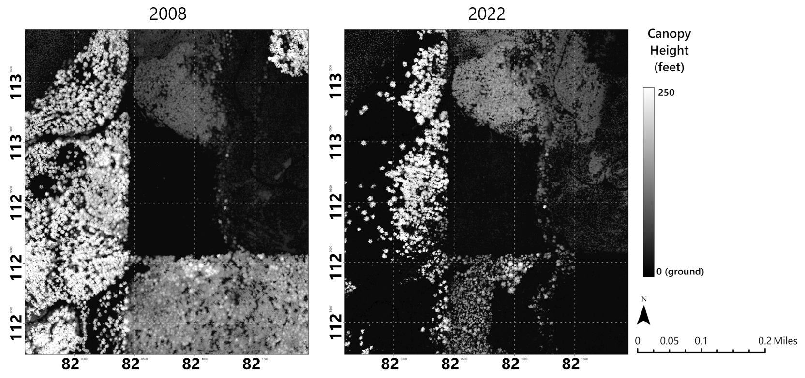
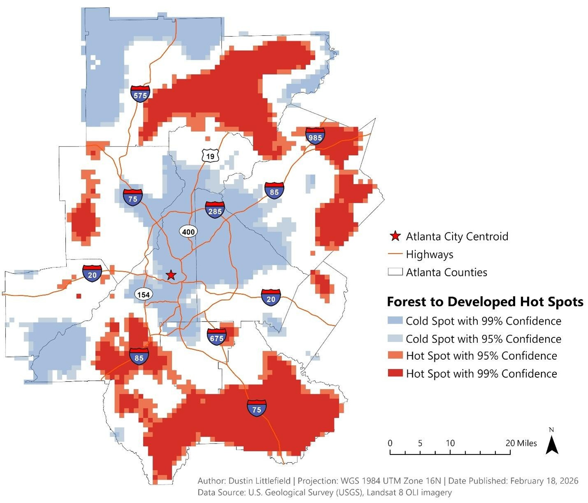

<h1 align="center" style="margin-top:12px; margin-bottom:4px;">
  Dustin Littlefield
</h1>

  Spatial Data Science • Remote Sensing • LiDAR • Environmental Modeling

## About Me
Greetings, I’m a geospatial analyst with a focus on natural resources. I have a strong educational foundation in data science, GIS, and graduate‑level remote sensing. After over a decade in medical laboratory science, I transitioned into geospatial data science to focus on natural resource management, geospatial analytics, and clear technical communication. Recently, for remote sensing coursework at Penn State, I developed LiDAR workflows for wildfire‑affected forest structure in Oregon. This includes developing terrain models, canopy height metrics, and conducting environmental impact analysis. My strengths include wrangling data, building geospatial data science pipelines, LiDAR processing, and generating practical insights from complex, spatial data.

<h2>Current Project</h2>

  <strong style="font-size: 1.15em;">Waterloo-Park-LiDAR-Tree-Detection-Pipeline (In Progress)</strong> 
  <strong>Last Updated:</strong> May 2026  
  An open exploration of multiple techniques to detect and quantify individual trees in Waterloo Park in Lebanon, Oregon. The goal is to experiment with and gain a greater understanding of the geometry, algorithms, and libraries associated with automated LiDAR point processing.  
  <strong>Tools:</strong> LP360 | Python | ArcGIS Pro | Jupyter Notebooks   
  <strong>Focus:</strong> LiDAR | Forestry | Forest Identification | Machine Learning Classification  
  <strong>Report:</strong>
  <a href="https://github.com/dustinlit/Waterloo-Park-LiDAR-Tree-Detection">
  Waterloo-Park-LiDAR-Tree-Detection-Pipeline
    </a>

An exploration of machine learning techniques to detect and quantify individual trees in Waterloo Park in Lebanon, Oregon.

<h2>Featured Projects</h2>

<!-- LiDAR Post-Fire Forest Structure -->

  <strong style="font-size: 1.15em;">LIDAR Post‑Fire Forest Structure Analysis</strong> 
  <strong>Last Updated:</strong> May 2026  
  A LiDAR‑based workflow for canopy height modeling, terrain differencing, and vegetation structure metrics in wildfire‑affected landscapes. This project focuses on quantifying canopy loss, structural change, and terrain exposure following the 2020 Beachie Creek Fire using LP360 and ArcGIS Pro.  
  <strong>Tools:</strong> LP360 | Raster Generation | ArcGIS Pro | 3D Structural Analysis  
  <strong>Focus:</strong> LiDAR | Wildfire | Forest Structure  
  <strong>Report:</strong>
  <a href="https://dustinlit.github.io/Beachie-Creek-LiDAR-Postfire-Analysis/">
    Beachie Creek LiDAR Post‑Fire Analysis
  </a>

  

<!-- Burn Severity & Vegetation Mortality -->

  <strong style="font-size: 1.15em;">Remote Sensing Assessment of Burn Severity and Vegetation Mortality in the 2020 Beachie Creek–Lionshead Complex Fire</strong> 
  <strong>Completed: </strong> March 2026  
  This analysis utilizes pre‑ and post‑fire Sentinel‑2 satellite imagery to assess vegetation mortality and burn severity across the Beachie Creek–Lionshead Complex Fire. Results show that approximately 50% of old‑growth forest within the study area experienced mortality, with moderate to severe burn clusters concentrated around Santiam Canyon.  
  <strong>Tools:</strong> ArcGIS Pro | Landsat 8 | NDVI/NBR/dNBR | USGS Burn Severity Classification | Terrain Derivatives  
  <strong>Focus:</strong> Wildfire | Burn Severity | Vegetation Mortality | Remote Sensing  
  <strong>Report:</strong>
  <a href="https://dustinlit.github.io/Burn-Severity-and-Vegetation-Mortality-Analysis-of-the-Beachie-Creek-Lionshead-Complex-Fire/">
    Burn Severity & Vegetation Mortality Report
  </a>

  
  

<!-- Atlanta Urban Growth -->

  <strong style="font-size: 1.15em;">Land‑Cover Classification and Change Detection of Urban Growth in the Atlanta Metropolitan Region (1999–2021)</strong> 
  <strong>Completed:</strong> February 2026  
  A multi‑temporal land‑cover change detection analysis mapping two decades of urban expansion in the Atlanta metropolitan region. Results show outward suburban growth patterns and spatially uneven development, highlighting the strengths and limitations of remote sensing for capturing fine‑scale urban heterogeneity.  
  <strong>Tools:</strong> ArcGIS Pro | Landsat 7/8 | Unsupervised Classification | Raster Analysis  
  <strong>Focus:</strong> Land Cover Classification | ML | Urban Development  
  <strong>Report:</strong>
  <a href="https://dustinlit.github.io/Atlanta-Urban-Sprawl-Change-Detection/">
    Atlanta Urban Growth Change Detection
  </a>

  

<!-- California Wildfire Ignition ML -->

  <strong style="font-size: 1.15em;">Geospatial Machine Learning Pipeline for Wildfire Ignition Risk in California</strong> 
  <strong>Archived:</strong> December 2025  
  This archived project implements a machine learning pipeline to model wildfire ignition probability across California using environmental, demographic, topographic, and spatial predictors. Results highlight elevated ignition risk in wildland‑urban interface zones, driven by road density, population gradients, and long‑term moisture deficits.  
  <strong>Tools:</strong> Python | Scikit‑learn | Pandas | Rasterio | ArcGIS Pro  
  <strong>Focus:</strong> Wildfire | ML Modeling | Environmental Analytics | Multidimensional Data  
  <strong>Report:</strong>
  <a href="https://dustinlit.github.io/California-Wildfire-Ignition-ML-Modeling/">
    California Wildfire Ignition ML Modeling
  </a>

  

<!-- Dixie Fire -->

  <strong style="font-size: 1.15em;">2021 Dixie Fire Burn Severity Analysis</strong> 
  <strong>Completed:</strong> February 2026  
  A burn severity assessment of the 2021 Dixie Fire using Landsat‑derived spectral indices. Results reveal highly heterogeneous burn patterns, with high‑severity zones concentrated in steep terrain and areas with limited access for suppression efforts.  
  <strong>Tools:</strong> ArcGIS Pro | Landsat 8 | NBR/dNBR | USGS Burn Severity Classification  
  <strong>Focus:</strong> Wildfire | Burn Severity | Remote Sensing  
  <strong>Report:</strong>
  <a href="https://dustinlit.github.io/Dixie-Fire-Burn-Severity-Analysis/">
    Dixie Fire Burn Severity Report
  </a>

  

<!-- Pennsylvania Hydrology -->

  <strong style="font-size: 1.15em;">Random Forest–Based Streamflow Forecasting Using Long‑Term Climate and Hydrologic Data in Pennsylvania</strong> 
  <strong>Completed:</strong> March 2026  
  A machine learning model forecasting streamflow using long‑term climate and watershed variables. The model captures nonlinear hydrologic relationships and highlights the importance of lagged predictors, with performance varying across hydrologic conditions and extreme events.  
  <strong>Tools:</strong> ArcGIS Pro | Space Time Cube | Forest‑Based Forecast | TerraClimate  
  <strong>Focus:</strong> Hydrology | ML | Environmental Modeling  
  <strong>Report:</strong>
  <a href="https://dustinlit.github.io/Pennsylvania-Hydrology-ML-Streamflow-Forecasting/">
    Pennsylvania Streamflow Forecasting
  </a>

  

## Additional Projects

- **[Satellite Land‑Cover Classification (ML)](https://dustinlit.github.io/Satellite-Land-Cover-Classification-ML/)** — Supervised Sentinel‑2 land‑cover classification using machine learning.

- **[Iowa Crop Classification & NDVI Analysis](https://dustinlit.github.io/Iowa-Crop-Classification-NDVI-Analysis/)** — Corn/soybean classification and NDVI‑based vegetation health mapping.

- **[Geospatial Map Gallery](https://dustinlit.github.io/Geospatial-Map-Gallery/)** — Curated gallery of cartographic products across multiple domains.

- **[Spatial Regression Analysis (Milwaukee)](https://dustinlit.github.io/Spatial_Regression_Milwaukee/)** — Regression and spatial autocorrelation analysis of socioeconomic patterns.

- **[Dogs 101 Navigation App](https://dustinlit.github.io/Dogs101/)** — Python geospatial app mapping 228 dog‑friendly locations with routing.

<h2>Technical Skills</h2>

  <strong>Programming:</strong>
  Python | R | SQL | Git/GitHub

  <strong>GIS & Remote Sensing:</strong>
  ArcGIS Pro | QGIS | Landsat/Sentinel | Terrain analysis

  <strong>LiDAR:</strong>
  PDAL | ArcGIS 3D Analyst | Canopy height & differencing workflows | LP360

  <strong>Modeling & ML:</strong>
  Geospatial Data Wrangling | Random Forest | Spatial ML | Feature engineering

  <strong>Environmental Analysis:</strong>
  Wildfire severity | Vegetation metrics | Hydrology & climate data

  <strong>Communication:</strong>
  Cartography | Technical writing | Reproducible workflows

<h2>Current Work</h2>

  <strong>LiDAR Workflow Development:</strong>
  Building a workflow for canopy height modeling, terrain differencing, and forest structure metrics using LP360 and ArcGIS Pro.

  <strong>Wildfire Analytics:</strong>
  In addition to utilizing environmental data in machine learning for wildfire analysis, I am concrentrating on multi-sensor analysis of burn severity and vegetation mortality, with a focus on spectral indices and terrain‑driven patterns and integrating LIDAR to estimate the impacts of vertical structures and ladder fuels.

  <strong>Graduate Remote Sensing Studies:</strong>
  Advancing coursework in remote sensing, environmental modeling, and geospatial analytics through Penn State’s graduate program.

  <strong>Professional Background:</strong>
  Drawing on 15 years as a Medical Laboratory Scientist, applying rigorous quantitative methods, quality control discipline, and reproducible workflow design to geospatial and environmental analytics.

  <strong>Portfolio Expansion:</strong>
  Refining existing project documentation, home page layout, project summaries, and map presentations for a clean portfolio.

